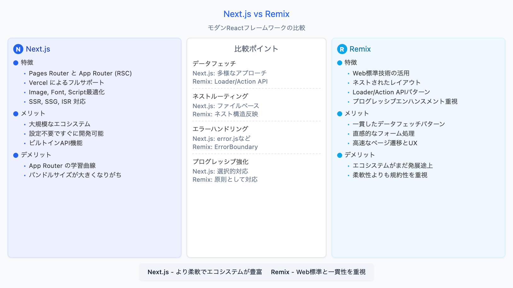

# AI図解ジェネレーター

ユーザーの入力内容をもとにAIでHTMLを描画し、それを画像化させることで綺麗な図解が作れるサービスです。

## 🎬 デモ

> **注**: デモGIFを追加するには、アプリケーションの使用風景を録画し、`public/demo.gif`として保存してください。



以下のようなテキスト入力から、美しい図解を自動生成します：

```
プロダクトエンジニアの思考と役割
- 従来のエンジニア思考：技術に閉じた視点、「何を作るか」に焦点
- プロダクトエンジニア思考：プロダクト全体を見渡す視点、「何を実現するか」に焦点
- 重要な気づき：技術者としての視点を超え、ビジネス課題の解決を考える
```

生成結果例：

> **注**: 生成結果の例を`public/example.png`として保存してください。


## 📝 概要

このアプリケーションは、テキスト入力から自動的に図解を生成し、PNG画像としてエクスポートできるウェブサービスです。Claude APIを活用して、ユーザーの入力内容を解析し、美しくモダンなデザインの図解を生成します。

特に以下の点に注力しています：
- テキスト要素の適切な余白設定（padding: 8px〜12px）
- 十分な行間（line-height: 1.4〜1.6）による可読性向上
- 段落や項目間の適切なマージン（margin: 8px〜12px）設定
- shadcn/uiスタイルに準拠したモダンなデザイン

## ✨ 機能

- テキスト入力からAIによる図解の自動生成
- 生成された図解のPNG画像へのエクスポート
- モダンなUIとレスポンシブデザイン
- 16:9のアスペクト比に最適化された図解生成

## 🛠️ 技術スタック

- **フロントエンド**: React, React Router
- **スタイリング**: Tailwind CSS, shadcn/ui
- **画像変換**: html-to-image
- **AI生成**: Claude API (Anthropic)

## 🚀 開発環境のセットアップ

### 前提条件

- Node.js 18.0.0以上
- npm 9.0.0以上
- Claude API キー

### インストール

```bash
# リポジトリのクローン
git clone https://github.com/yourusername/generate-post-diagram.git
cd generate-post-diagram

# 依存関係のインストール
npm install

# 環境変数の設定
# .envファイルを作成し、Claude API Keyを設定
echo "CLAUDE_API_KEY=your_api_key_here" > .env
```

### 開発サーバーの起動

```bash
npm run dev
```

アプリケーションは http://localhost:3000 で実行されます。

### ビルド

```bash
npm run build
```

### 本番環境での実行

```bash
npm run start
```

## 📋 使い方

1. テキスト入力欄に図解したい内容を入力します
2. 「図解を生成」ボタンをクリックします
3. AIが入力内容に基づいて図解を生成します
4. 「画像としてダウンロード」ボタンをクリックして、生成された図解をPNG形式で保存できます

## 🔍 注意点

- 生成される図解は16:9のアスペクト比に最適化されています
- テキスト要素は読みやすさを確保するため、適切な余白と行間を設定しています
- 現在のバージョンでは、生成される画像のクオリティに制限があります
- 複雑な図解の場合、生成に時間がかかることがあります

## 📊 今後の改善予定

- 画像生成クオリティの向上
- テンプレート機能の追加
- ユーザーによるデザインカスタマイズオプションの拡充
- 複数の図解形式（フローチャート、マインドマップなど）のサポート

## 📄 ライセンス

MIT

## 🤝 貢献

1. このリポジトリをフォークします
2. 新しいブランチを作成します (`git checkout -b feature/amazing-feature`)
3. 変更をコミットします (`git commit -m 'Add some amazing feature'`)
4. ブランチにプッシュします (`git push origin feature/amazing-feature`)
5. プルリクエストを作成します
